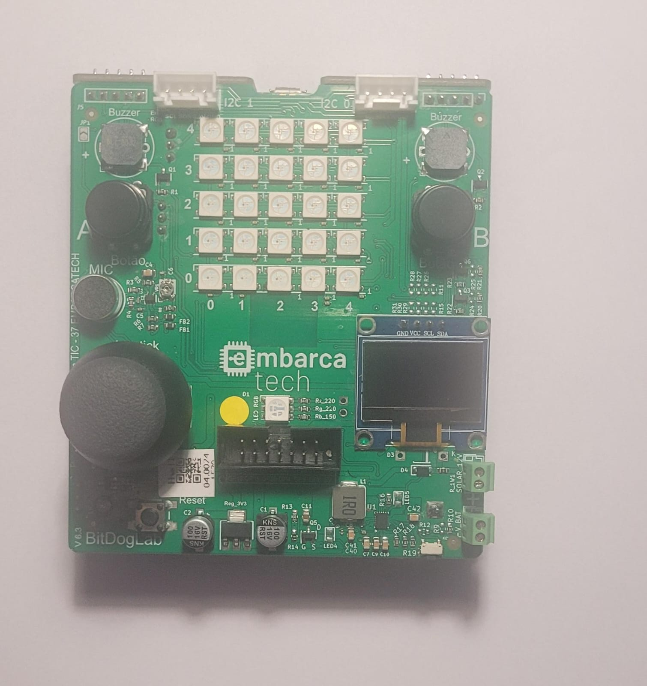

    

# Sobre o Repositório

Este repositório é destinado a guardar e disponibilizar todos os projetos desenvolvidos durante a residência de sistemas embarcados - EMBARCATECH.

# Plataforma Utilizada 

Todos os projetos utilizam a placa [BITDOGLAB](https://github.com/BitDogLab/BitDogLab).

# Liçencas

Os códigos desenvolvidos nesse repositório são de uso livre, conforme a [MIT license](https://opensource.org/licenses/MIT).
