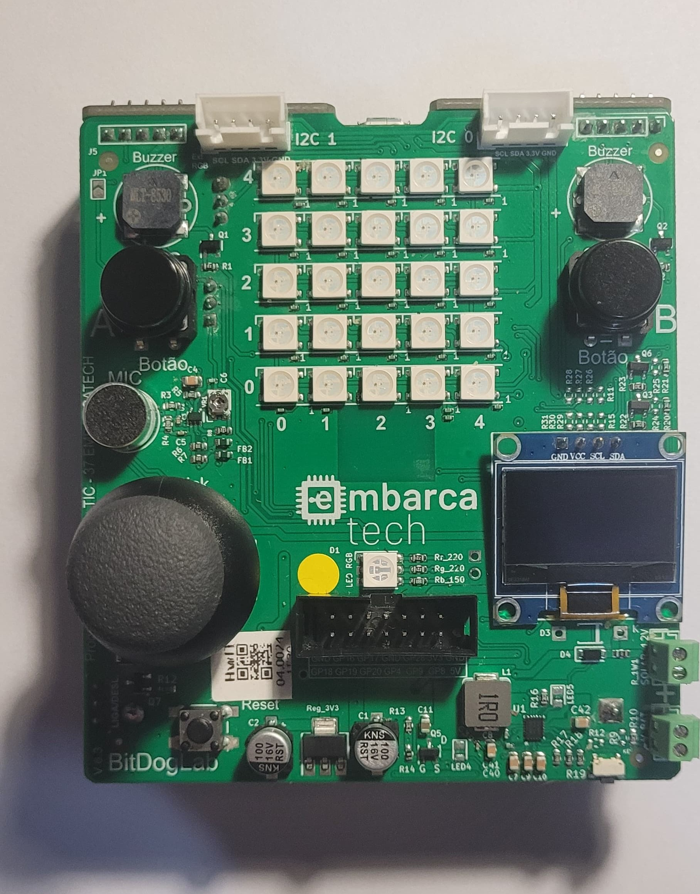

    

# Sobre o Repositório

Este repositório é destinado a guardar e disponibilizar todos os projetos desenvolvidos durante a residência de sistemas embarcados - EMBARCATECH.

# Plataforma Utilizada 

Todos os projetos utilizam a placa [BITDOGLAB](https://github.com/BitDogLab/BitDogLab).

# Projetos

📌 Contador decrescente com contagem de aperto de botão

Projeto que utiliza dois botões: o primeiro reinicia um contador regressivo e o segundo contabiliza quantas vezes foi pressionado.  
As informações são atualizadas em tempo real em um display OLED.

🎮 Leitura dos valores dos potenciômetros do Joystick

Leitura contínua dos valores analógicos dos eixos X e Y do joystick com aplicação de filtro de média móvel.  
Os valores suavizados são exibidos em um display OLED somente quando houver mudança nas leituras.

🌡️ Monitoramento de temperatura interna do RP2040

Leitura da temperatura interna do microcontrolador RP2040 utilizando o ADC.  
O valor é convertido para Celsius e exibido em um display OLED, demonstrando o uso do sensor interno de forma prática.

# Licenças

Os códigos desenvolvidos nesse repositório são de uso livre, conforme a [GNU license].
