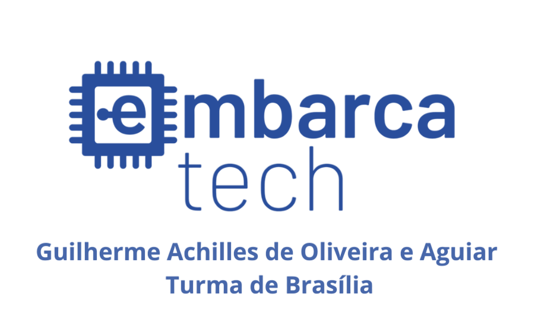
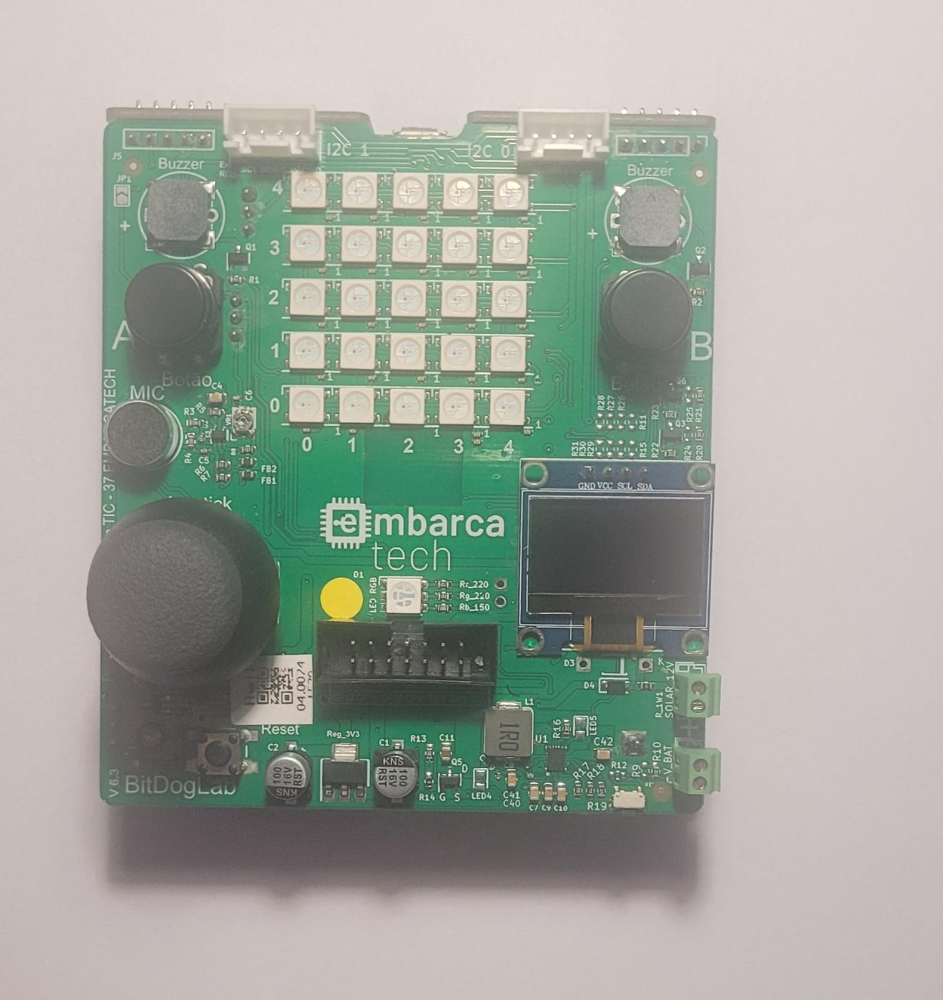

    

# Sobre o Repositório

Este repositório é destinado a guardar e disponibilizar todos os projetos desenvolvidos durante a residência de sistemas embarcados - EMBARCATECH.

# Plataforma Utilizada 

Todos os projetos utilizam a placa [BITDOGLAB](https://github.com/BitDogLab/BitDogLab).

A placa possui resumidamente:

- 1x - microcontrolador RP2040  
- 1x - Analógico  
- 1x - Matriz de LED endereçável 5x5  
- 1x - Display OLED  
- 2x - Push Buttons  

# Liçencas
GPL - 3.0
